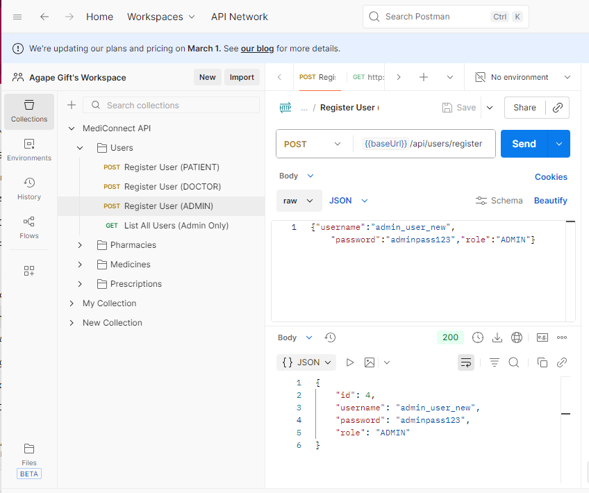
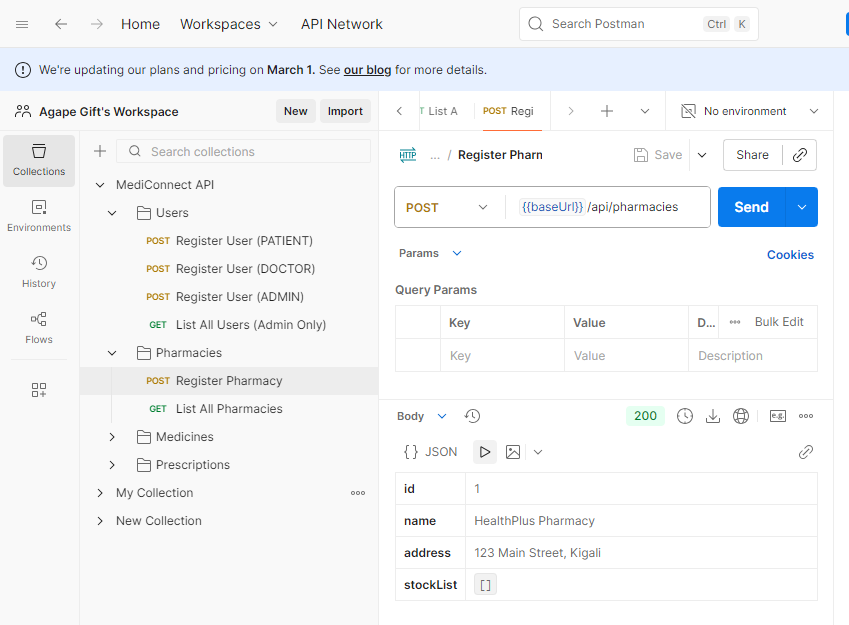
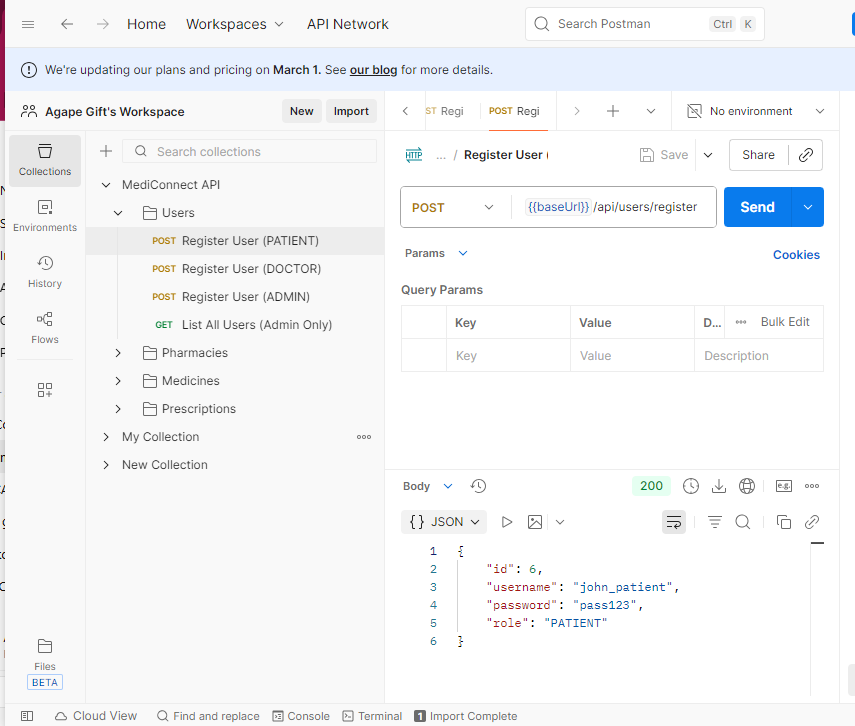

# MediConnect RW

MediConnect is a Java Spring Boot application designed to streamline the management of medicines, pharmacies, prescriptions, and users. It provides a robust backend for healthcare-related operations, supporting CRUD operations, authentication, and more.

## Features

User registration, authentication, and role-based access
Medicine and pharmacy management
Prescription creation and tracking
Stock and inventory management
RESTful API endpoints
Secure configuration with Spring Security

## Project Structure
src/
  main/
    java/com/example/mediconnect/
      controller/      # REST controllers for API endpoints
      model/           # Entity classes (Medicine, Pharmacy, etc.)
      repository/      # Spring Data JPA repositories
      SecurityConfig.java
      DataInitializer.java
      MediConnectApplication.java
    resources/
      application.properties
  test/
    java/com/example/mediconnect/
      MediConnectApplicationTests.java
## The server will start at http://localhost:8080.

Example API Usage
List all medicines:
GET /api/medicines
Add a new pharmacy:
POST /api/pharmacies
Register a user:
POST /api/users/register
Authenticate:
POST /api/auth/login

## Sample API calls (use Postman or curl)

### Register as patient
```
POST /api/users/register
Content-Type: application/json

{"username":"alice","password":"pass"}
```

### Create a doctor (admin only)
```
POST /api/users/register
X-Role: ADMIN
{"username":"drbob","password":"doc","role":"DOCTOR"}
```

### Doctor issues prescription
```
POST /api/prescriptions
X-Role: DOCTOR
{"doctorName":"drbob","patientName":"alice","medication":"Paracetamol","notes":"Take twice a day"}
```

### Pharmacy registers and updates stock
```
POST /api/pharmacies
{"name":"Pharma1","address":"Kigali"}

POST /api/pharmacies/1/stock?medicineId=1&quantity=100
X-Role: PHARMACY
```

### List all pharmacies
```
GET /api/pharmacies
```

## Screenshots
Below are sample application screens from the `testing-screenshots` folder in this repository.









See code comments for more details.
